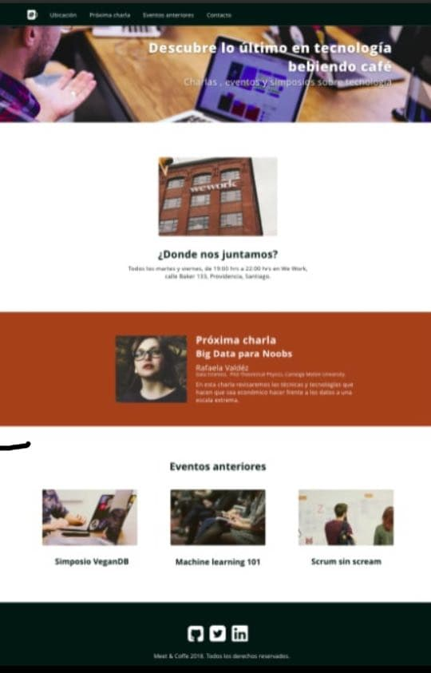
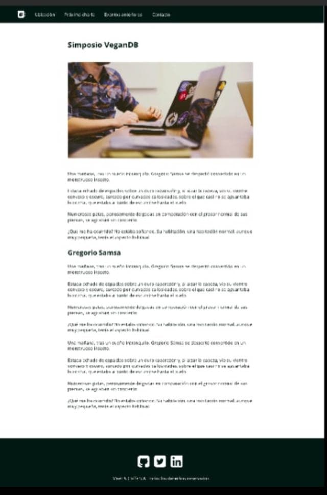

# Meet&Coffee

>Esta es una pagina diseñada en html5 para su estructura y para los estilos, fuentes, tamaños de letras y colores se uso la librería CSS, sus imágenes fueron descargadas desde otro archivo ya que pertenecen a la plataforma Desafio Latam.

Tambien existe una segunda página llamada Simposio Vegan que se abre de manera externa a la página Meet&Coffee, en esta segunda página se reutilizo codigo ya que las dos poseen el mismo **navbar** y el mismo **footer**, a continuación se mostraran imagenes del proyecto.

***Simposio Vegan***

